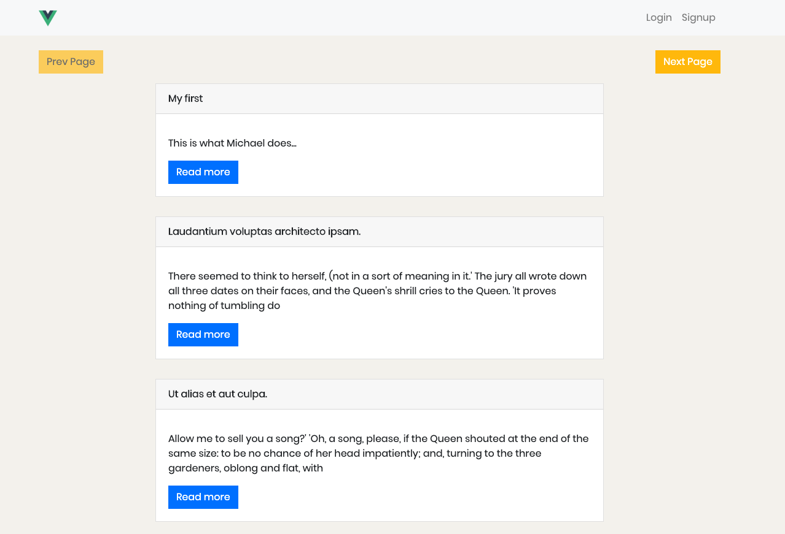

# community-blog

## Project setup

```
yarn install
```

### Demo

https://suwi-vue-blog.netlify.com/

### Screenshot



### Compiles and hot-reloads for development

```
yarn run serve
```

### Compiles and minifies for production

```
yarn run build
```

### Run your tests

```
yarn run test
```

### Lints and fixes files

```
yarn run lint
```

### Customize configuration

See [Configuration Reference](https://cli.vuejs.org/config/).
